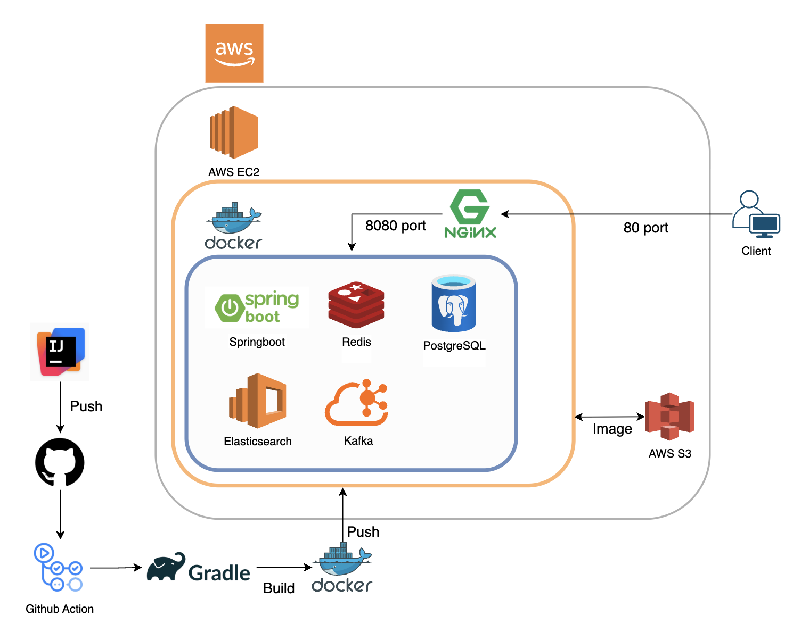
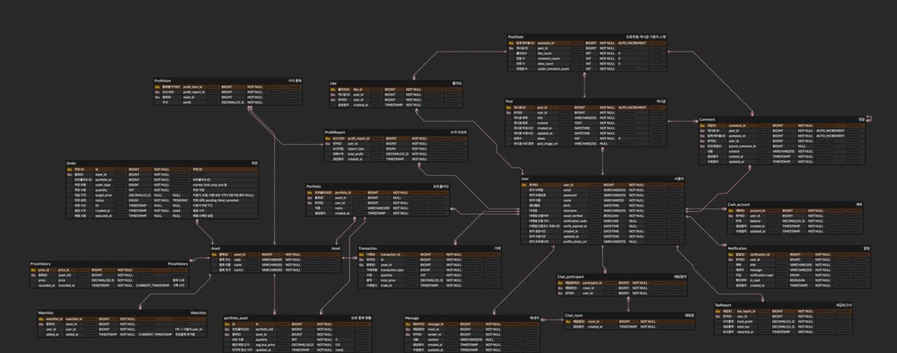

# Finsight-Social

### 종목 투자 및 소셜 기능을 제공하는 MSA 기반 백엔드 멀티모듈 프로젝트

---

## 목차

1. [프로젝트 개요](#프로젝트-개요)
2. [모듈 구성](#모듈-구성)
3. [기술 스택](#기술-스택)
4. [아키텍처 다이어그램](#아키텍처-다이어그램)
5. [ERD (Entity–Relationship Diagram)](#erd-entity–relationship-diagram)
6. [배포 URL & Swagger UI](#배포-url--swagger-ui)
7. [구현 예시 대표 이미지](#구현-예시-대표-이미지)
8. [상세 구현 기능](#상세-구현-기능)
9. [API 엔드포인트 정리](#api-엔드포인트-정리)

---

## 프로젝트 개요

“**Finsight-Social**”은 MSA(Microservice Architecture) 기반으로, 종목 투자 기능과 소셜 커뮤니티 기능을 통합 제공하는 백엔드 멀티모듈 프로젝트입니다. 실시간 시세 푸시, 포트폴리오·관심 종목 관리, 가상 주문 처리, 세금 리포트, SNS 기능 등을 구현하였습니다.

## 모듈 구성

```groovy
rootProject.name = 'finsight-social'
include 'auth-service'
include 'portfolio-service'
include 'price-service'
include 'order-service'
include 'report-service'
include 'tax-service'
include 'sns-service'
include 'common'
```

각 모듈은 Dockerfile을 통해 컨테이너화되었으며, `docker-compose.prod.yml`로 프로덕션 환경에서 오케스트레이션됩니다. GitHub Actions 워크플로우(`deploy.yml`)와 스크립트(`deploy.sh`)로 AWS ECR에 이미지를 푸시하고, t3.large 인스턴스의 EC2에 배포하였습니다.

## 기술 스택

* **언어·프레임워크**: Java 17, Spring Boot 3.4.5
* **ORM & DB**: JPA (Hibernate), PostgreSQL
* **인증·보안**: Spring Security, JWT (Access/Refresh Token), FeignClient(Mailgun)
* **실시간 기능**: WebSocket(Finnhub 구독)
* **캐시 & 순위**: Redis ZSet
* **배치 & 메시징**: Spring Batch, Apache Kafka
* **도커화 & 오케스트레이션**: Docker, Docker Compose
* **CI/CD & 배포 인프라**: GitHub Actions, AWS ECR, AWS EC2 (t3.large)
* **API 문서화**: Swagger UI (springdoc-openapi)

## 아키텍처 다이어그램



## ERD (Entity–Relationship Diagram)



## 배포 URL & Swagger UI

* **서비스 베이스 URL**: `http://52.79.38.106/`
* **Swagger UI** (각 모듈 포트)

  * auth-service: `http://52.79.38.106:8081/swagger-ui/index.html`
  * portfolio-service: `http://52.79.38.106:8082/swagger-ui/index.html`
  * price-service: `http://52.79.38.106:8083/swagger-ui/index.html`
  * order-service: `http://52.79.38.106:8084/swagger-ui/index.html`
  * report-service: `http://52.79.38.106:8085/swagger-ui/index.html`
  * tax-service: `http://52.79.38.106:8086/swagger-ui/index.html`
  * sns-service: `http://52.79.38.106:8087/swagger-ui/index.html`


## 상세 구현 기능

* **회원가입·로그인 (auth-service)**

  * 이메일 인증 (Mailgun, FeignClient) 후 JWT Access/Refresh Token 발급
  * Spring Security 기반 헤더 토큰 검증
* **포트폴리오 & 관심 종목 (portfolio-service)**

  * CRUD API
  * 종목 추가 시 price-service 연동 메타데이터 요청
* **종목 메타데이터 & 실시간 시세 (price-service)**

  * Finnhub 메타데이터 수집 배치 (Spring Batch)
  * WebSocket 구독으로 실시간 시세 푸시
* **가상 주문 처리 (order-service)**

  * 시장가 / 지정가 주문
  * CashAccount 업데이트 및 거래내역 기록
  * 알림 시스템 연동
* **세금 계산·보고 & 리포트 (report-service / tax-service)**

  * 거래 기반 세금 계산
  * 주간·월간 리포트 집계 및 조회 API
* **SNS 기능 (sns-service)**

  * 게시글·댓글·대댓글·좋아요·메시지·검색
  * 인기 게시물: Redis ZSet 집계
  * 프로필 사진 업로드 (S3)

